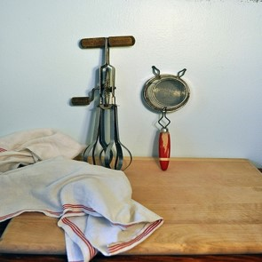
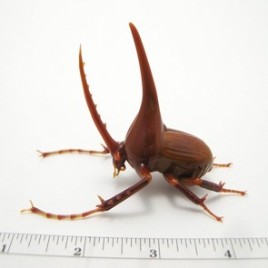
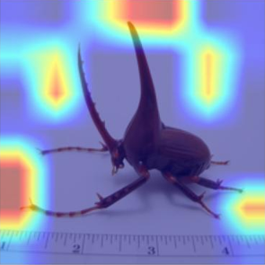
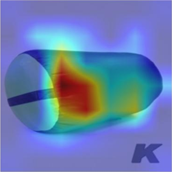
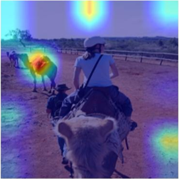
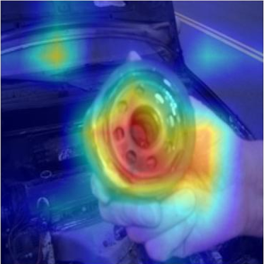
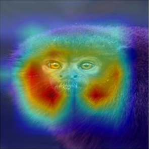
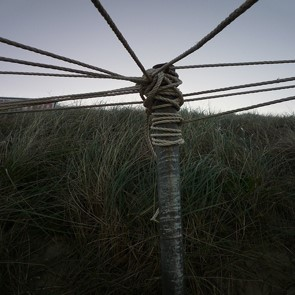

# anonymous

## Heatmap Comparison Experiment

This experiment compares different models' ability to capture image features, focusing on the following models:
- **GroundTruth**: The ground truth image.
- **Swin-T**: Heatmap generated using Swin-T Transformer model.
- **Swin-T + AFBO**: Heatmap generated using Swin-T Transformer model with AFBO module.

The comparison results are as follows:

| Image Category      | GroundTruth  | Swin-T  | Swin-T + AFBO  |
|---------------------|--------------|---------|----------------|
| **Strainer** |  |  |  |
| **Shoe Shop**  |  |  |  |
| **Rhinoceros Beetle** |  |  |  |
| **Orange** |  |  |  |
| **Sleeping Bag** |  |  |  |
| **Titi Monkey** |  |  |  |
| **Arabian Camel** |  |  |  |
| **Oil Filter** |  |  |  |
| **Pole** |  |  |  |
| **Steam Locomotive** |  |  |  |
